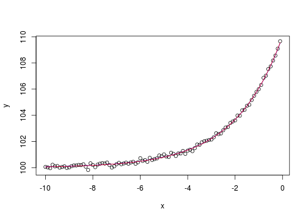
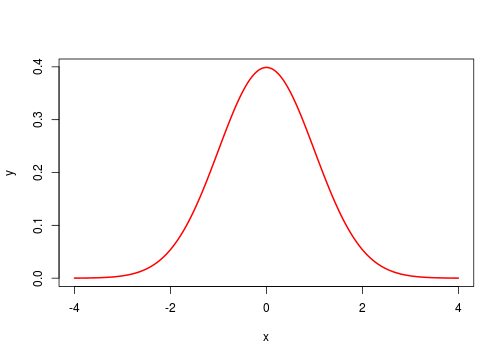
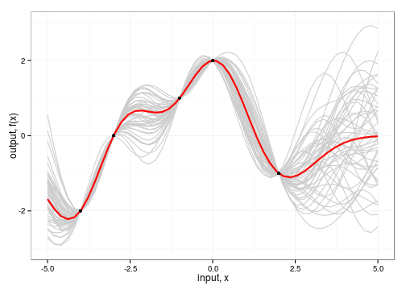

---

intelie talk 
============

## Gaussian Processes for regression
### 01/10/2012

---

Machine learning

---

 Supervised learning
 --------------------
 
 the problem of learning input-output mappings from empirical data (the training dataset).
 
 that is:
 
 * we observe some inputs $x_i$ and some outputs $y_i$
 * we assume $y_i = f(x_i)$ for some unknown $f$
 

---

 Regression problem
 --------------

* *Aim*: recover underlying process from **observed data**, allowing prediction of *continuous* quantities.
 

---

 Probabilistic approach
 ------------------------

* probabilistic models can make predicitions, decisions, etc.
* generative models can be used to handle missing inputs
* uncertantity is a crucial concept

---

 Basic Rules of Probability
 ----------------------------

* probabilities are non-negative $p(x) \ge 0 \forall x$

* probabilities normalize $\sum_{x \in X} p(x) = 1$ 

* join probability of $x$ and $y$ is $p(x,y)$

* mariginal probability of $x$ is: $p(x) = \sum_{y} p(x, y)$

* conditional probability of $x$ given $y$ is $p(x|y) = p(x,y)/p(y)$

* Bayes Rule:
$$
  p(x,y) = p(x) p(y|x) = p(y) p(x|y) \\\
  \implies p(y|x) = \frac{ p(x|y) p(y)  }{ p(x)} 
$$

---

 Expectation and Variance
 ----------------------------

* the *expectation* (mean, average) of a random variable is:

$$ \mu = \mathbb{E}[x] = \int{ x p(x) dx} $$

* the *variance* is:

$$
  \sigma^2 = \mathbb{V}[x] = \int{ (x - \mu)^2 p(x) dx } = \mathbb{E}[x^2] - \mathbb{E}[X]^2
$$

---
 
Univariate Gaussian density $y \in \mathbb{R}, \quad y \sim \mathcal{N}(\mu, \sigma^2)$

$$ p(y|\mu,\sigma^2) = \frac{1}{\sqrt{2\pi\sigma^2}} \exp { \left( - \frac{ ( y - \mu)^2 }{2\sigma^2} \right) } $$

---

Multivariate Gaussian density $y \in \mathbb{R}^D, \quad y \sim \mathcal{N}(\mathbf{\mu}, \Sigma)$

$$ p(\mathbf{y}|\mathbf{\mu},\Sigma) = \lvert 2\pi\Sigma \rvert^{-\frac{1}{2}} \exp{ \left\[ - \frac{1}{2} ( \mathbf{y} - \mathbf{\mu} )^T \Sigma^{-1} (\mathbf{y} - \mathbf{\mu} )  \right\] } $$

---
  Sampling from a Gaussian distribution
  --------------------------------------
  
* $\mathbf{z} \sim \mathcal{N}(0,1) $

http://en.wikipedia.org/wiki/Normal_distribution#Generating_values_from_normal_distribution

---
  Sampling from a multivariate distribution
  ------------------------------------------

http://www.ideal.ece.utexas.edu/~gjun/ee379k/html/clustering/gmm_em/

--- 
 
 Bayesian learning overview
 ---------------------
 
 * make **prior** assumptions on the value of the parameters **before** we see the data
 
 * **prior** distribution over the parameters: $p(\theta)$
 
 * model of the data given the parameters, **likelihood** function $p(D|\theta)$
 
 * posterior distribution of model parameters:
 
$$ p(\theta | D) = \frac{ p(D|\theta) p(\theta) } {p(D)} $$ 
 
 
 

---

Gaussian Processes
========================

* A Gaussian process is a generalization of a Gaussian distribution to infinitely many random variables 

* Inference takes place directly in function space.

---

A Gaussian process is completely specified by its mean function and co-variance function. 

We define mean function $m(\mathbf{x})$ and the covariance function $k(\mathbf{x}, \mathbf{x}')$ of a real process $f(\mathbf{x})$ as 

$$f(x) \sim \mathcal{GP}(m(\mathbf{x}), k(\mathbf{x}, \mathbf{x}'))  $$

--- 

We'll consider the squared exponential (SE) covariance function

$$ cov( f(\mathbf{x}\_p), f(\mathbf{x}\_q) =  k(\mathbf{x}\_p, \mathbf{x}\_q) = \exp( - \frac{1}{2} | \mathbf{x}\_p - \mathbf{x}\_q |^2 ) $$

* which is also known as Radial Basis Function (RBF) kernel.

* covariance between *outputs* is written as function of the *inputs*

* it can be shown that the SE covarience function corresponds to a **Bayesian linear regression model** with an infinite number of basis functions.

--- 

 Bayesian linear regression
 ---------------------------
 
 a GP can be shown to be equivalent to the Bayesian linear regression model.

 Assuming noise $\epsilon \sim \mathcal{N}(0,\sigma^2)$, the linear regression model is: 
 $$ f(\mathbf{x}) = \mathbf{x}^T \mathbf{w}, \quad y = f + \epsilon $$

 and we put a zero mean Gaussian prior with covariance matrix $\Sigma_p$ on the weights:
 
 $$ \mathbf{w} \sim \mathcal{N}(\mathbf{0},\Sigma_p^2) $$
 

---

 Bayesian linear regression 
 -----------------------------------------------

The linear model is extended with function $\phi(\mathbf{x})$ which maps a $D$-dimensional input vector $\mathbf{x}$ into an $N$ dimensional feature space, so now the model becomes:

$$ f(\mathbf{x}) = \phi(\mathbf{x})^T \mathbf{w} $$

this enables the linear model perform well even in non-linear problems.

---

Specification of the covariance function implies a distribution over functions. Given a number of input points $X\_\ast$ we can sample from:

$$ \mathbf{f}\_\ast \sim \mathcal{N}(\mathbf{0}, \mathbf{K}_\ast )  $$

 
 * $\mathbf{K}\_\ast = k(X, X\_\ast)$ 
 
---

 Prediction with noise-free observations
 -----------------------------------------

Consider we know ${(\mathbf{x}\_i, f\_i) | i = 1, \dots, n}$, the joint distribution of the training outputs $\mathbf{f}$ and the test outputs $\mathbf{f}\_\ast$ according to the prior is:

$$ \begin{bmatrix} \mathbf{f} \\\ \mathbf{f}\_\ast \end{bmatrix}
\sim \mathcal{N} \left\( \begin{bmatrix} \mathbf{\mu} \\\ \mathbf{\mu\_\ast} \end{bmatrix},
\begin{bmatrix}
\mathbf{K} &  \mathbf{K}\_\ast \\\
\mathbf{K}\_\ast^T  &  \mathbf{K}\_{\ast\ast} \\\
\end{bmatrix} \right\)
$$

 * $\mathbf{\mu} = ( m(\mathbf{x}\_i), \dots, m(\mathbf{x}\_n) ) $   
 * $K\_{ij} = k(\mathbf{x}\_i,\mathbf{x}\_j)$ is $n \times n$   
 * $\mathbf{K}\_\ast = k(X, X\_\ast)$ 
 * $\mathbf{K}\_{\ast\ast} = k(X\_\ast, X\_\ast)$
  

---

 Prediction with noise-free observations
 -----------------------------------------
 
 By rules for conditioning Gaussians, the posterior has the following form
 
 $$ \begin{aligned} 
 p(\mathbf{f}\_\ast | X\_\ast, X, \mathbf{f}) &= \mathcal{N}( \mathbf{f}\_\ast | \mathbf{\mu}\_\ast, \Sigma\_\ast ) \\\
 \mathbf{\mu}\_\ast &= \mathbf{\mu}(X\_\ast) + \mathbf{K}\_\ast^T \mathbf{K}^{-1} (\mathbf{f} - \mathbf{\mu}(X))  \\\
 \Sigma\_\ast &= \mathbf{K}\_{\ast \ast} - \mathbf{K}\_\ast^T \mathbf{K}^{-1} \mathbf{K}\_\ast  
 \end{aligned} $$ 
 
 
 The mean of the posterior distribution is also its mode, which is also called the *maximum a posteriori* (**MAP**) estimate.
 
---

 GP regression with SE kernel
 ------------------

---

 GP regression with SE kernel considering noise
 ----------------------------------------------

    ## Warning: Removed 11 rows containing missing values (geom_path).

--- 

 Non parametric method bayesian models
 -----------------------------------

 * very flexibe, state of the art results for regression
 
 * $O(n^3)$ flops, dominated by matrix inverse
 
 * *cholesky* is normally used because it's more numerically stable
 
 * still prohibitive for large $n$
  
 * Iterative methods: *Conjugate Gradient, Jacobi method, Gaussian Belief Propagation*
  
--- 

 Many other covarience functions
 ----------------------------------  
 
 * polynomial
 * Matérn
 * exponential, $\gamma$-exponential
 * rational quadratic
 * neural network
 
 
--- 
 
 Estimating free (hyper, kernel) parameters
 ----------------------------------
 
 
--- 
 
 Connections to GPs
 ---------------
 
 * SVM
 * Neural Nets
 * Splines
 * and others

---
  References
  ----------

  * C. E. Rasmussen & C. K. I. Williams, Gaussian Processes for Machine Learning,
  * Kevin Murphy, Machine Learning A Probalistic Perspective. 
  * http://www.jameskeirstead.ca/r/gaussian-process-regression-with-r/

